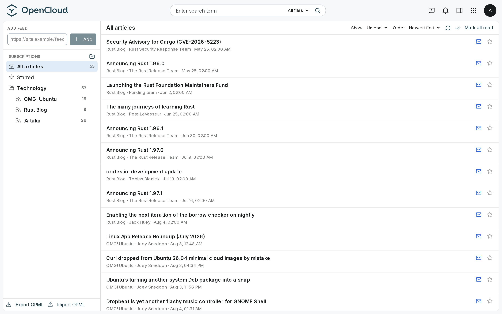
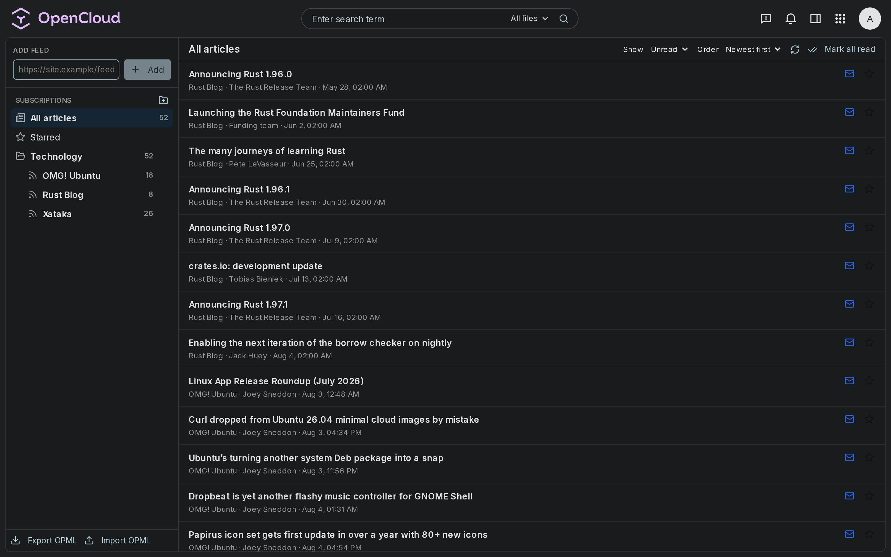
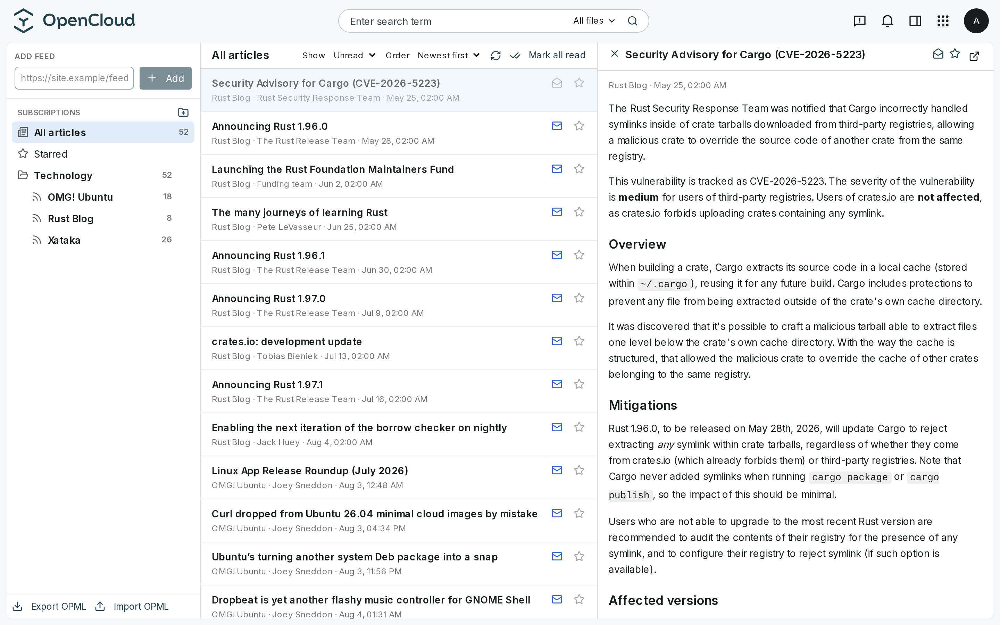
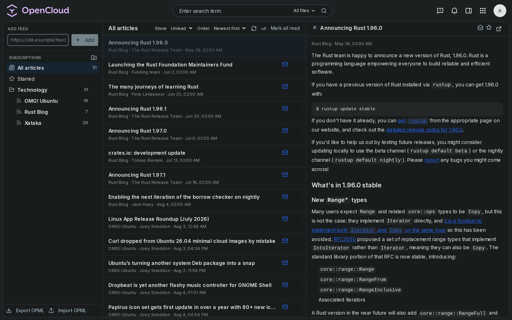

# ocnews

RSS/Atom reader for OpenCloud. It speaks the Nextcloud News API (v1.3), so
the official Nextcloud News app for Android works against it, and it ships
as a web extension that lives inside the OpenCloud UI.

> **This is beta software.** It is in active development, APIs and behavior
> may change, and you may hit bugs. Point it at your test server first and
> keep a backup of the data directory.

## Why this exists

I have been a big Nextcloud fan for many years. I run it, I like the
ecosystem, and the apps I use every day are Nextcloud apps. But over the
years the stack underneath became too much for me: PHP, a web server, a
database, cron jobs, app upgrades that pull half of Composer. Every machine
I put it on ends up feeling like a small datacenter.

OpenCloud takes a different route: everything it does, including what
Nextcloud does in PHP, runs inside a single Go binary. Light on resources,
quick to install, trivial to update, easy to reason about when something
breaks. It is younger, it has fewer apps, a smaller community, and less
maturity. I don't know yet whether it will win. But the foundation is a
good starting point, so I am following it closely, testing it in real use,
and contributing what I miss.

This reader is the first piece. The goal is to move the Nextcloud
experience I care about to OpenCloud while staying as compatible with
existing Nextcloud clients as possible. That is why the backend implements
the News REST API v1.3 instead of inventing its own: if you already use the
Nextcloud News app on Android, you can point it at ocnews and keep your
workflow.

## What works today

**Backend** (single static Go binary, SQLite, no external services):

- Full News API v1.3: folders, feeds, items, read/unread/starred state,
  sync endpoints (`/items`, `/items/updated`, bulk marking)
- Users come from OpenCloud itself: login validates against the server's
  Graph API (app passwords for clients, session tokens for the web), no
  separate user database to maintain
- Feed daemon: adaptive refresh intervals (quiet feeds back off, busy
  ones stay fresh), exponential backoff on errors, jitter so feeds never
  sync up, nightly retention of old read items
- HTML sanitization of every body at ingest (whitelist policy)
- Signed media proxy: feed images and audio/video play inside the app even
  under strict CSP setups, with HTTP Range streaming for seeking
- Full article extraction: feeds that only ship summaries can be fetched
  from the origin and extracted server side (readability), cached forever;
  feeds that already ship full text are detected and left alone
- OPML import/export, favicon cache, updater routes from the spec
- Spanish/English error messages negotiated per user

**Web extension** (Vue 3, installed like any OpenCloud web app):

- Sidebar with folders, feeds and unread counts; subscribe, rename, move,
  delete, mark-as-read per feed or folder
- Article list with unread/all filter, oldest/newest order, pagination
- Reading pane with real typography, images, in-app audio/video players,
  starred and read/unread toggles, open-original link
- OPML import/export from the UI

**Android**: the official Nextcloud News client works. Create an app token
in your OpenCloud account settings, then configure the app with your
server URL, username and that token. Display name, sync, marking, podcast
enclosures: all tested against it.

## Architecture

OpenCloud web extensions are frontend only, so the feed engine lives in a
companion service (the same pattern Collabora or the webmail extensions
use):

```
┌─────────────────────────────────────────────────────────────┐
│ OpenCloud Web                                               │
│   web-app-news (Vue 3 extension, in the app switcher)       │
│        │  same-origin REST, session auth                    │
└────────┼────────────────────────────────────────────────────┘
         │  /index.php/apps/news/api/v1-3/   (reverse proxy)
         ▼
   ocnews backend (Go, single binary)
   • News API v1.3          • feed fetcher daemon
   • sanitization           • signed media proxy
   • SQLite (multi-user)    • OpenCloud Graph auth
         ▲
         │  Basic auth (app password)
   Nextcloud News Android app (unmodified)
```

## Install

### Backend

```bash
git clone https://github.com/gnacho/ocnews
cd ocnews/backend
go test ./...
CGO_ENABLED=0 go build -trimpath -ldflags "-s -w" -o ocnews ./cmd/ocnews
```

Run it with an environment file (systemd unit with a dedicated user
recommended, see below):

```ini
OCNEWS_ADDR=:8094
OCNEWS_DATA_DIR=/var/lib/ocnews
OCNEWS_AUTH_MODE=opencloud
OCNEWS_OPENCOLOUD_URL=https://cloud.example.com
```

| Variable | Default | Meaning |
|---|---|---|
| `OCNEWS_ADDR` | `:8094` | listen address |
| `OCNEWS_DATA_DIR` | `./data` | SQLite, favicons, media cache, HMAC secret |
| `OCNEWS_AUTH_MODE` | `local` | `local` (own user table) or `opencloud` (Graph API) |
| `OCNEWS_OPENCOLOUD_URL` | - | OpenCloud server root, required in `opencloud` mode |
| `OCNEWS_FEED_INTERVAL` | `15m` | base refresh interval |
| `OCNEWS_MAX_GAP` | `6h` | ceiling for adaptive intervals |
| `OCNEWS_RETENTION_DAYS` | `90` | purge read non-starred items older than this, `0` disables |
| `OCNEWS_FETCH_TIMEOUT` | `20s` | per-feed HTTP timeout |
| `OCNEWS_LOG_LEVEL` | `info` | debug/info/warn/error |

In `local` mode, `AUTH_USER`/`AUTH_PASS` bootstrap the first admin.

### Reverse proxy

Expose the backend under the OpenCloud domain, the same path Nextcloud
would use. For nginx, inside the server block of your OpenCloud host:

```nginx
location /index.php/apps/news/ {
    proxy_set_header Host $host;
    proxy_set_header X-Forwarded-Proto $scheme;
    proxy_pass http://127.0.0.1:8094;
}
```

Do not route `/api/` or other prefixes to ocnews; the OpenCloud web client
uses them.

### Web extension

```bash
cd extension
npm install && npm run build
```

Copy `dist/` to the OpenCloud apps folder (one directory per app, this is
`WEB_ASSET_APPS_PATH`, commonly `/var/lib/opencloud/web/assets/apps` or
`/etc/opencloud/web/assets/apps`):

```
.../assets/apps/news/          # contents of extension/dist
```

Add `/etc/opencloud/apps.yaml` if it does not exist yet:

```yaml
news:
  config: {}
```

Restart OpenCloud. The News app appears in the app switcher.

## Screenshots

| Reader | Reader (dark) |
|---|---|
|  |  |

| Article with images and full text | Article (dark) |
|---|---|
|  |  |

Captured from a local development instance with the English UI.

## Roadmap

Ideas and rough order, not promises:

1. Extension polish: Spanish/English UI translations, mobile layout,
   keyboard navigation
2. Feed article filters (title/body/keyword rules, like the News 28.4
   filter API)
3. Full-text search across items
4. Release engineering: CI, goreleaser builds, install script
5. A standalone PWA client for mobile browsers (parked; the Android app
   covers the use case for now)
6. Track OpenCloud itself as it matures and adapt (the extension SDK is
   still moving)

## Contributing

Issues and pull requests are welcome, in English. Keep in mind this is a
one-person project run in spare time: with collaborations or support it
could grow faster, but I can't promise anything.

## License

AGPL-3.0. See [LICENSE](LICENSE).
